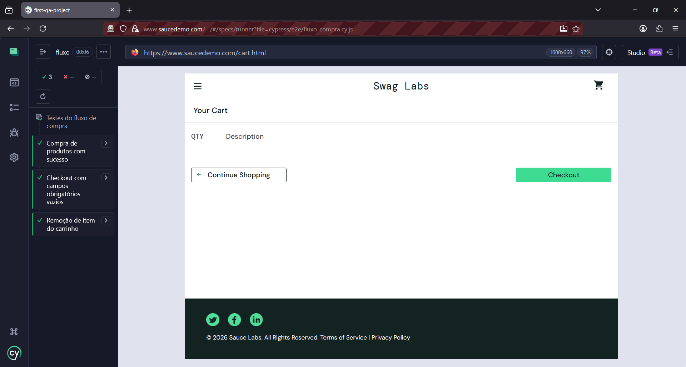

# Automação de testes E2E - Site Sauce Demo. 

Descrição:
Este projeto visa validar todo o fluxo de compra de um e-commerce, garantindo a qualidade e a funcionalidade da aplicação **SauceDemo**.

## 🎥 Demonstração dos Testes

Abaixo se encontra a execução dos testes automatizados do fluxo de compra, garantindo a integridade do carrinho e do checkout:



## 📊 Status da Automação
Atualmente, a suíte de testes cobre os principais fluxos de negócio:

| Suíte de Testes | Quantidade | Foco Principal |
| :--- | :---: | :--- |
| `login.cy.js` | CT01, CT02 e CT06 | Validação de acesso e mensagens de erro |
| `fluxo_compra.cy.js` | CT03, CT04 e CT05 | Jornada completa de compra e checkout |

## 📋 Casos de Teste

Abaixo estão detalhados os cenários funcionais que cobrem login, gerenciamento de carrinho e o fluxo completo de compra (E2E).

---

### CT01 – Login com credenciais válidas

- **Prioridade:** Altíssima  
- **Pré-condições:**  
  - Acesso à URL: https://www.saucedemo.com  
  - Massa de Dados: Usuário `standard_user` e Senha `secret_sauce`

#### Cenário
- **Dado** que estou na tela de Login  
- **Quando** digito usuário e senha corretos  
- **E** clico no botão **Login**  
- **Então** o sistema deve apresentar a tela principal  

#### Resultado Esperado
✅ O sistema deve liberar o acesso à aplicação.

---

### CT02 – Login com credenciais inválidas

- **Prioridade:** Alta  
- **Pré-condições:**  
  - Acesso à URL da aplicação  
  - Usuário ou senha inválidos

#### Cenário
- **Dado** que estou na tela de Login  
- **Quando** preencho usuário e senha inválidos  
- **E** clico no botão **Login**  
- **Então** o sistema deve exibir mensagem de erro 
> *"Epic sadface: Username and password do not match any user in this service"*
- **E** continuar na tela de login  

#### Resultado Esperado
❌ O sistema não deve permitir o login.

---

### CT03 – Compra de produto com sucesso (E2E)

- **Prioridade:** Altíssima  
- **Pré-condições:**  
  - Estar logado com `standard_user`
  - Produtos disponíveis em estoque  
- **Massa de Dados:** 
  - Produto: **Sauce Labs Bike Light**
  - Checkout: Nome, Sobrenome e CEP genéricos.

#### Cenário
- **Dado** que estou logado na página de produtos  
- **Quando** adiciono o item **"Sauce Labs Bike Light"** ao carrinho  
- **E** sigo para o checkout preenchendo as informações de envio  
- **E** clico no botão **Finish**  
- **Então** devo visualizar a mensagem  
  > *"Thank you for your order!"*

#### Resultado Esperado
✅ O pedido deve ser finalizado e o sistema deve exibir a tela **"Checkout: Complete!"**.

---

### CT04 – Checkout com campos obrigatórios vazios

- **Prioridade:** Média  
- **Pré-condições:**  
  - Estar logado com `standard_user` e com um item no carrinho  
  - Estar na página **"Checkout: Your Information"**

#### Cenário
- **Dado** que estou na tela de informações do Checkout  
- **Quando** deixo os campos **First Name**, **Last Name** e **Zip Code** vazios  
- **E** clico no botão **Continue**  
- **Então** o sistema deve exibir uma mensagem de erro  
- **E** o fluxo de compra não deve avançar  

#### Resultado Esperado
⚠️ O sistema deve validar a obrigatoriedade dos campos e bloquear a finalização.

---

### CT05 – Remoção de item do carrinho

- **Prioridade:** Média  
- **Pré-condições:**
  - Estar logado com `standard_user`
  - Ter pelo menos um item adicionado ao carrinho  
  - Estar na página **"Your Cart"**

#### Cenário
- **Dado** que possuo um item adicionado ao carrinho  
- **Quando** clico no botão **Remove**  
- **Então** o item deve ser removido da listagem  

#### Resultado Esperado
🛒 O carrinho deve ser atualizado e o produto não deve mais estar visível.

---

### CT06 – Login com usuário bloqueado

- **Prioridade:** Alta  
- **Pré-condições:** 
  - Acesso à tela de Login da aplicação
  Massa de Dados:
  - Usuário: `locked_out_user`
  - Senha: `secret_sauce`

#### Cenário
- **Dado** que estou na tela de Login  
- **Quando** informo as credenciais do usuário `locked_out_user`  
- **E** clico no botão **Login**  
- **Então** o sistema deve exibir mensagem de usuário bloqueado  
- **E** negar o acesso à aplicação  

#### Resultado Esperado
🚫 Acesso negado ao usuário bloqueado.

---

### 📌 Observações

- Casos de teste escritos em **BDD (Gherkin)**
- Cobertura dos principais fluxos funcionais da aplicação
- Detalhamento de escopo e estratégia disponível no **[Plano de Testes (PDF)](./docs/Plano-de-Testes.pdf)**

### Tecnologias Utilizadas:

- Cypress
- JS
- Node.js

## 🚀 Como Executar os Testes

Para rodar este projeto localmente, certifique-se de ter o [Node.js](https://nodejs.org/) instalado. 

1. **Clonar e instalar:**
   ```bash
   git clone https://github.com/lupatellesg/first-qa-project.git
   cd first-qa-project
   npm install
    ```
2. **Executar:**

    Interface Visual: `npx cypress open`
    
    Modo Terminal: `npx cypress run`